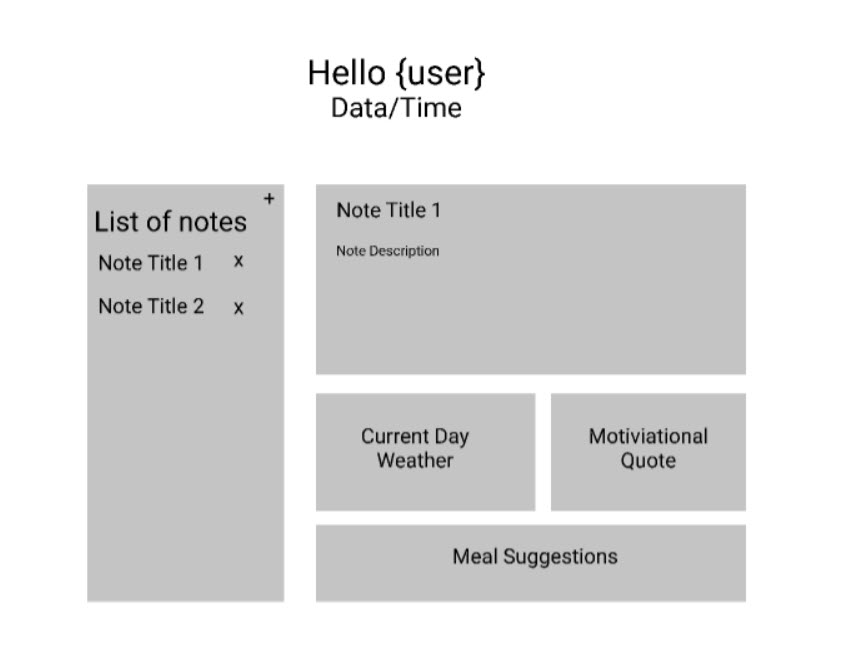

# TheDailyBeat
In this applicaiton, we have created the ability to make daily life easier for our users.  When using this application, a user can view and update a weekly planner that saves their notes and schedule for the day.  They will also have an option to view the weather, motivational quotes and recipe of the day. 

This application will use multiple APIs, Handlbars.js, MySQL, Heroku, Node.js, Express.js.

# Wireframe for the website

## Desktop

# Acceptance Criteria

A user can login and be sent to their planner desktop.

When on the desktop, a user can  view their monthly calendar, weather for the day, daily quote and recipe of the day.

When a user clicks on their daily schedule they are able to add and save a note/appointment.

When a user selects save todays inspirational quote they are able to save their quote as a favorite.

If a user logs back in or refreshes the page they can see their saved items. 

