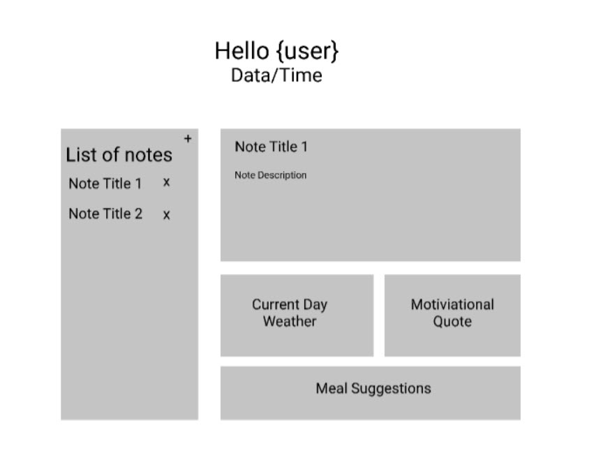
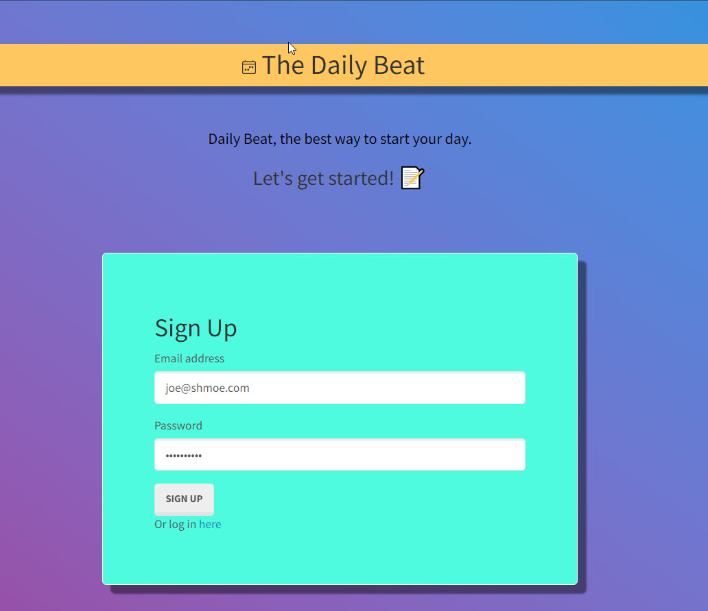
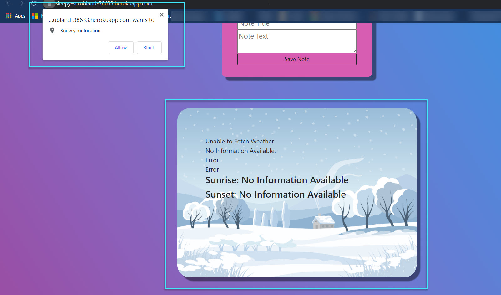
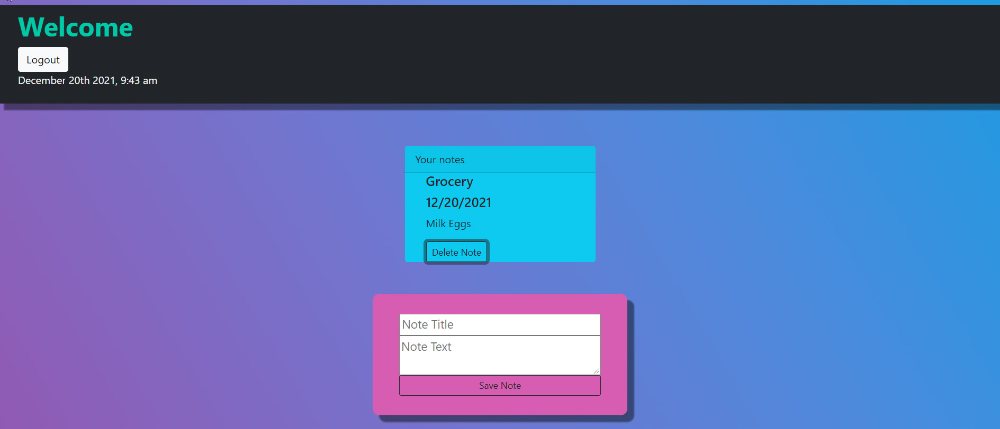
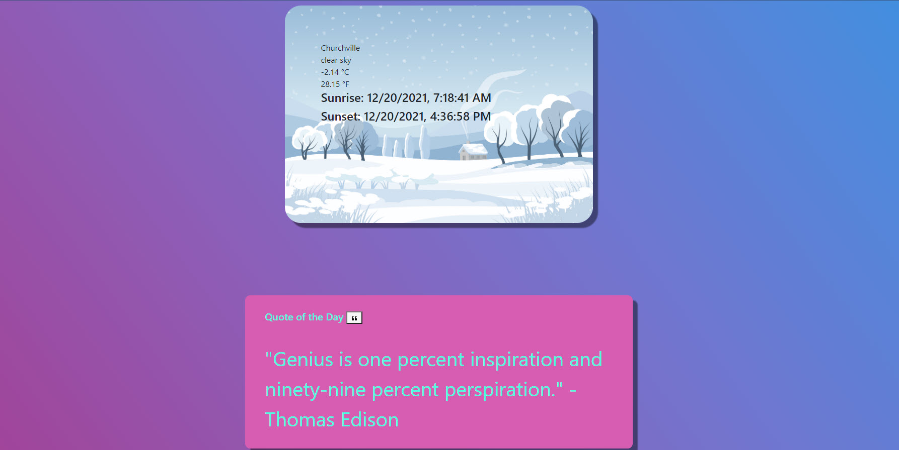
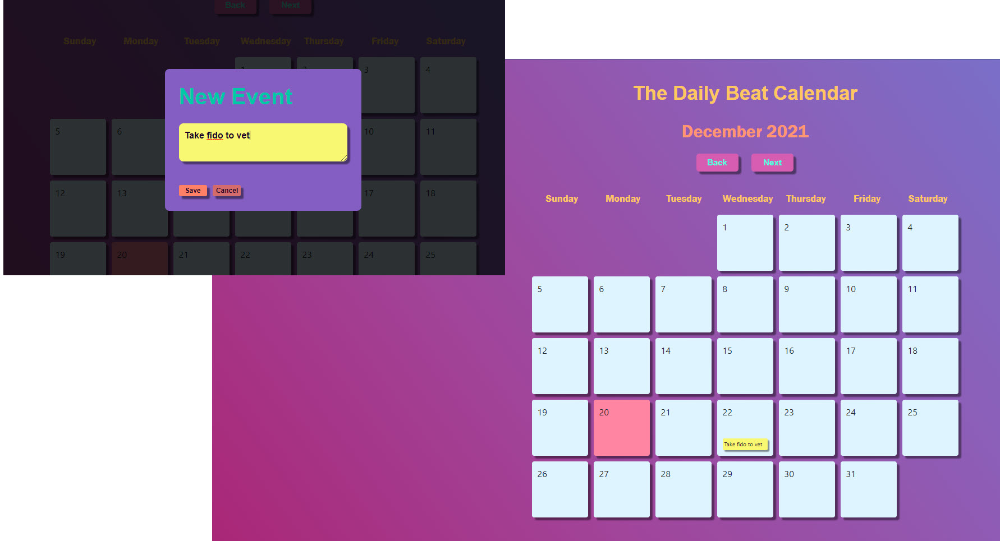

# TheDailyBeat

# Description
We have created the ability to make daily life easier for our users.  When using this application, a user can help keep their life in order in one convenient location.  The user can view and update a weekly planner that saves their notes and schedule for the day.  They will also have an option to view the weather in their current location as well as motivational quotes. 

This application will use applications such as multiple APIs, Handlbars.js, MySQL, Heroku, Node.js, Express.js.

## Table of Contents
* [Links](#links)

* [Wireframe](#wireframe)

* [Preview](#preview)

* [Criteria](#criteria)

* [Credits](#credits)

* [License](#license)

# Links

https://sleepy-scrubland-38633.happ.com/signuperoku

https://github.com/ChristianAnti/TheDailyBeat

# Wireframe

## Desktop

# Preview

# Criteria

A user can Sign up and be sent to their planner desktop.

A user can login and be sent to their planner desktop.

When on the desktop, a user can  view their monthly calendar.

When a user clicks on their calendar they are able to add and save a note/appointment.

When a user clicks on their calendar they are able to view their saved note/appointment.

When on the desktop, a user can view their weather for the day.

When on the desktop, a user can view their daily quote.

When a user selects quote button they are able to view a new quote.

When on the desktop, a user can create a note.

When on the desktop, a user can view their notes.

If a user logs back in or refreshes the page they can still see their saved items. 

# Credits

W3 Schools: https://www.w3schools.com/

MDN Web Docs: https://developer.mozilla.org/en-US

Open Weather API: https://openweathermap.org/api

Type.fit Quotes API Docs: https://type.fit/api/quotes

Bootstrap: https://getbootstrap.com/

Font Awesome: https://fontawesome.com/

jQuery: https://jquery.com/

Passport: http://www.passportjs.org/

Handlebars: https://handlebarsjs.com/

Node: https://nodejs.org/en/

MySql: https://www.mysql.com/

Express: https://expressjs.com/

Heroku: https://id.heroku.com/login

# License

MIT License

Copyright (c) 2021 amaddatu

Permission is hereby granted, free of charge, to any person obtaining a copy
of this software and associated documentation files (the "Software"), to deal
in the Software without restriction, including without limitation the rights
to use, copy, modify, merge, publish, distribute, sublicense, and/or sell
copies of the Software, and to permit persons to whom the Software is
furnished to do so, subject to the following conditions:

The above copyright notice and this permission notice shall be included in all
copies or substantial portions of the Software.

THE SOFTWARE IS PROVIDED "AS IS", WITHOUT WARRANTY OF ANY KIND, EXPRESS OR
IMPLIED, INCLUDING BUT NOT LIMITED TO THE WARRANTIES OF MERCHANTABILITY,
FITNESS FOR A PARTICULAR PURPOSE AND NONINFRINGEMENT. IN NO EVENT SHALL THE
AUTHORS OR COPYRIGHT HOLDERS BE LIABLE FOR ANY CLAIM, DAMAGES OR OTHER
LIABILITY, WHETHER IN AN ACTION OF CONTRACT, TORT OR OTHERWISE, ARISING FROM,
OUT OF OR IN CONNECTION WITH THE SOFTWARE OR THE USE OR OTHER DEALINGS IN THE
SOFTWARE.